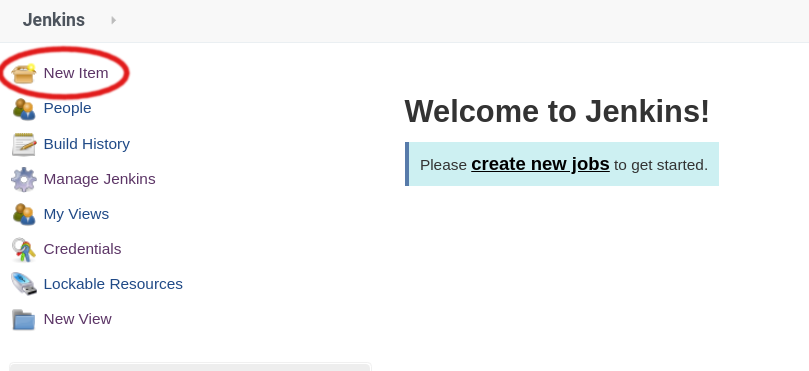
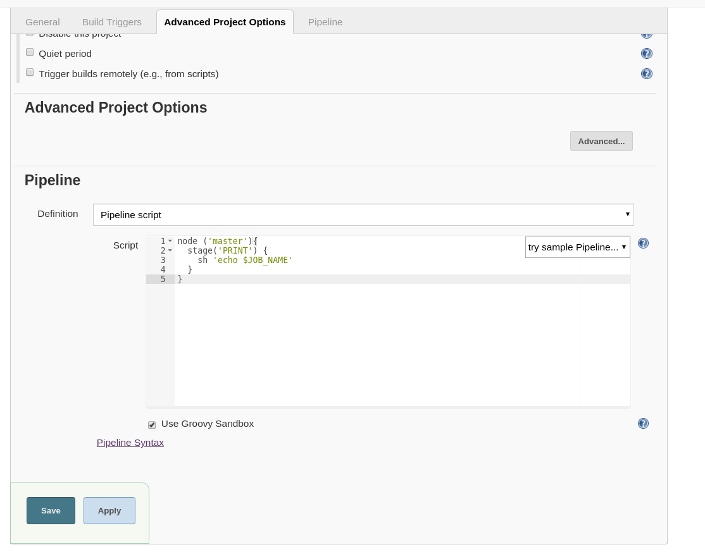
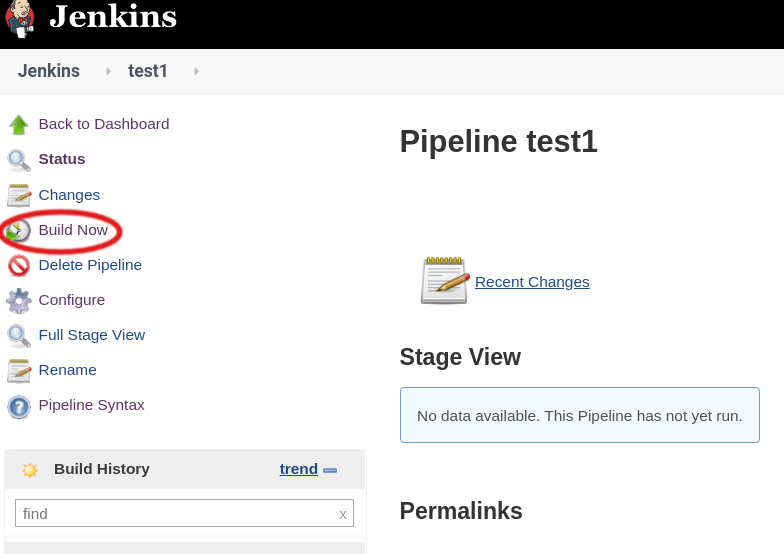
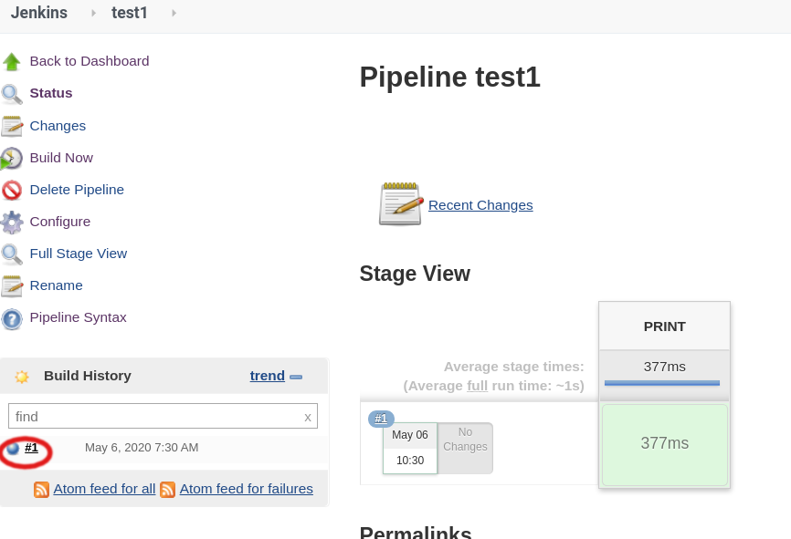
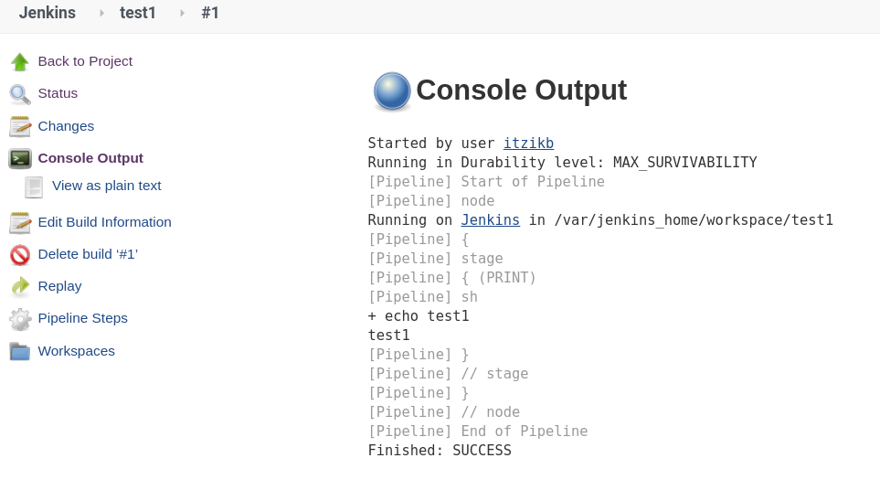

# Creating a simple Pipeline job

### Creating a simple Pipeline job

In Jenkins click on **New Item** 



 **Choose Pipeline** and enter the job name


### Creating a stage 

Under pipeline in the 'script' box enter the following

```text
node ('master'){
  stage('PRINT') {
    sh 'echo $JOB_NAME'
  }
}
```

Then Click on **Save**



This will create a job with one stage called **PRINT** which will print the job's name to the console log

### Running the job

Click on **Build now**



When you run **Build Now** **and** and you'll see you the job was executed

Click on \#1 \(The build number\) on the left



### Watching the output

The click on the **Console output and** and you'll see something like the following:




### Exercise

Create a new pipeline job with 2 stages - One called **Fetch** and one called **Run**

In each stage run a simple shell command


