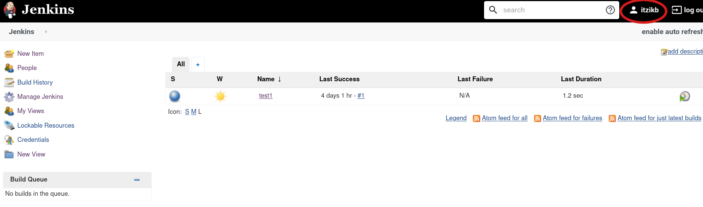
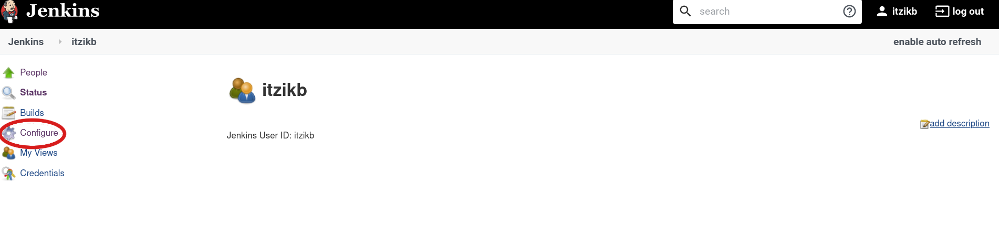
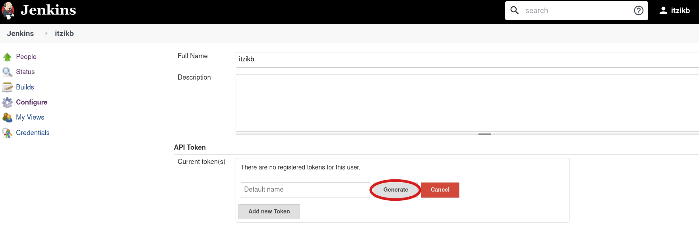
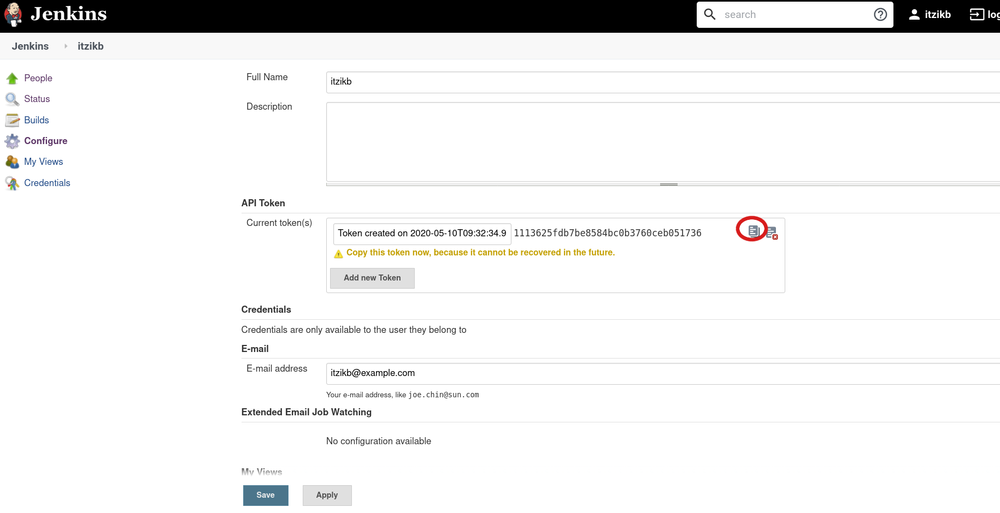

# Jenkins job builder \(JJB\) installation and configuration

JJB creates Jenkins XML configuration file from a YAML/JSON definition file and just uploads it to Jenkins

[JJB Documentation](https://docs.openstack.org/infra/jenkins-job-builder/index.html)

## Installing JJB

```text
$ mkdir jjb
$ virtualenv .venv
$ source .venv/bi/activate
$ pip install jenkins-job-builder
```

## Configuring JJB

### Getting a token

You'll need a token for uploading jobs to Jenkins  
At the top right of Jenkins Web UI click on your user name → Configure → Add New Token → Generate  
Copy the token and then hit Save.










### A JJB configuration file

[Configuration file documentation](https://docs.openstack.org/infra/jenkins-job-builder/execution.html#configuration-file)  


The following is a configuration file for accessing a specific Jenkins. You'll need a user and a token.  
The following is an example of a configuration file.

```text
[job_builder]
ignore_cache=True
keep_descriptions=False
include_path=.:scripts:~/git/
recursive=False
exclude=.*:manual:./development
allow_duplicates=False
update=all

[jenkins]
user=itzikb
password=1113625fdb7be8584bc0b3760ceb051736
url=http://127.0.0.1:8080
query_plugins_info=False
##### This is deprecated, use job_builder section instead
#ignore_cache=True
```

### Testing and Updating a job

To check the job definition you can run the following. If there are no errors you'll see  
the Job's XML definition on your screen.

```text
$ jenkins-jobs test tests/yamlparser/fixtures/templates002.yaml
```

To send the output to a directory instead of to the screen

```text
$ jenkins-jobs test -o output tests/yamlparser/fixtures/templates002.yaml
```

To upload the job to Jenkins

```text
$ jenkins-jobs --conf myjenkins.conf update myjob.yaml
```

A Command I'm using in my day to day uploading to our Jenkins \(From rhos-qe-jenkins directory\) is

```text
$ PYTHONHTTPSVERIFY=0 jenkins-jobs --conf ~/config-staging.conf --ignore-cache update --recursive jobs DFG-osasinfra-shiftstack_on_vms-16_director-rhel-virthost-3cont_1comp-ipv4-geneve-hybrid_flat_4.3_3master_3worker-ovn-update-4.4
```

In the above example DFG-osasinfra-shiftstack\_on\_vms-16\_director-rhel-virthost-3cont\_1comp-ipv4-geneve-hybrid\_flat\_4.3\_3master\_3worker-ovn-update-4.4 is the job's name

